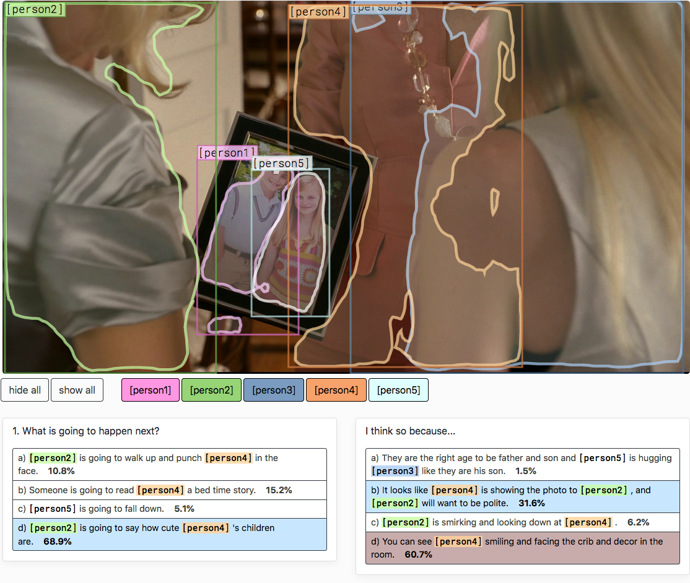

# From Recognition to Cognition: Visual Commonsense Reasoning(r2c基于Paddle复现)

# 一、简介

本项目基于paddle复现From Recognition to Cognition: Visual Commonsense Reasoning中所提出的r2c模型，该模型用于解决视觉常识推理（Visual Commonsense Reasoning）任务，即给模型一个图像、一些对象、一个问题，四个答案和四个原因，模型必须决定哪个答案是正确的，然后在提供四个原因选出答案的最合理解释。

下面提供一个例子进行说明：


对输入的图像、对象和问题 What is going to be happen next? ，模型需要选择答案d) 和原因d)。

论文地址：https://arxiv.org/abs/1811.10830

参考项目：https://github.com/rowanz/r2c

# 二、复现精度

|          | *Q* → A | *QA* → R | *Q* → AR |
| -------- | ------- | -------- | -------- |
| 原论文   | 63.8    | 67.2     | 43.1     |
| 复现精度 | 64.1    | 67.2     | 43.2     |

# 三、数据集

本项目所使用的数据集为 [VCR](https://visualcommonsense.com/download/) ，由来自110K个电影场景的290K个多项选择的QA问题组成。

对于问题答案和原因，提供bert预训练好的特征，可从如下地址进行下载：

- `https://s3-us-west-2.amazonaws.com/ai2-rowanz/r2c/bert_da_answer_train.h5`
- `https://s3-us-west-2.amazonaws.com/ai2-rowanz/r2c/bert_da_rationale_train.h5`
- `https://s3-us-west-2.amazonaws.com/ai2-rowanz/r2c/bert_da_answer_val.h5`
- `https://s3-us-west-2.amazonaws.com/ai2-rowanz/r2c/bert_da_rationale_val.h5`
- `https://s3-us-west-2.amazonaws.com/ai2-rowanz/r2c/bert_da_answer_test.h5`
- `https://s3-us-west-2.amazonaws.com/ai2-rowanz/r2c/bert_da_rationale_test.h5`

建议的数据结构为：

```
data/
|-- vcr1images/ 
|   |-- VERSION.txt
|   |-- movie name, like movieclips_A_Fistful_of_Dollars
|   |   |-- image files, like Sv_GcxkmW4Y@29.jpg
|   |   |-- metadata files, like Sv_GcxkmW4Y@29.json
|-- bert_feature/
|   |-- bert_da_answer_train.h5
|   |-- bert_da_rationale_train.h5
|   |-- bert_da_answer_val.h5
|   |-- bert_da_rationale_val.h5
|   |-- bert_da_answer_test.h5
|   |-- bert_da_rationale_test.h5
|-- train.jsonl
|-- val.jsonl
|-- test.jsonl
|-- README.md
```

可以自行修改文件地址，但是对应的要修改文件读取中文件路径。

# 四、环境依赖

- Python 3.7
- paddle 2.2.1
- paddlenlp 

# 五、快速开始

### 训练

对于Q→ A，运行如下命令：

```
python train.py -floader model/saves/flagship_answer
```

对于*QA* → R，运行如下命令：

```
python train.py -floader model/saves/flagship_rationale -relation
```

### 测试

加载模型进行Q→ A测试，运行如下命令：

```
python eval.py -floader model/saves/flagship_answer
```

#注：这里需要保证模型的名字为best.pd（或者可以在utils/paddle_misc的restore_best_checkpointh函数中修改模型的名字）。

加载模型进行QA→ R测试，运行如下命令：

```
python eval.py -floader model/saves/flagship_rationale -relation
```

测试*Q* → AR效果，运行如下命令：

```
python eval_q2ar.py -answer_preds model/saves/flagship_answer/valpreds.npy -rationale_preds model/saves/flagship_rationale/valpreds.npy
```

### 使用预训练模型

预训练最优模型下载：

​	链接: https://pan.baidu.com/s/1VeG64RFxoBbs1ivZUOkJ0g 

​	提取码: c4ir 

将对应模型放到对应的文件目录下即可。
# 六、代码结构：

```
|--data
|--dataloader
|   |--__init__.py
|   |--box_utils.py
|   |--mask_utils.py
|   |--vcr.py  #加载数据
|--model
|   |--multiatt
|   |   |--__init__.py
|   |   |--model.py  #主模型
|   |   |--mask_softmax.py
|   |   |--BilinearMatrixAttention.py
|   |--saves
|   |   |--flagship_answer
|   |   |   |--best.pd
|   |   |--flagship_rationale
|   |   |   |--best.pd
|--utils
|   |--__init__.py
|   |--detector.py  #图像特征处理
|   |--paddle_misc.py
|   |--Resnet50.py
|   |--Resnet50_imagnet.py
|   |--torch_resnet50.pkl
|--train.py
|--eval.py  #进行Q→ A和QA → R测试
|--eval_q2ar.py  #进行Q → AR测试
|--config.py
|--predict.py  #进行单个数据的测试
```

模型训练的所有参数信息都在config.py中进行了详细的注释.

# 七、模型信息：

| 信息     | 说明        |
| -------- | ----------- |
| 发布者   | KiritoSSR   |
| 时间     | 2021.12     |
| 框架版本 | Paddle2.2.1 |
| 应用场景 | 多模态      |
| 支持硬件 | GPU、CPU    |


